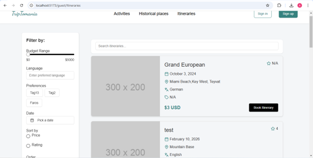
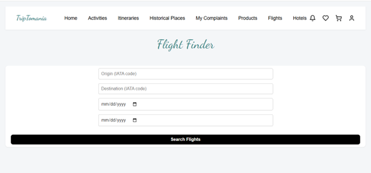
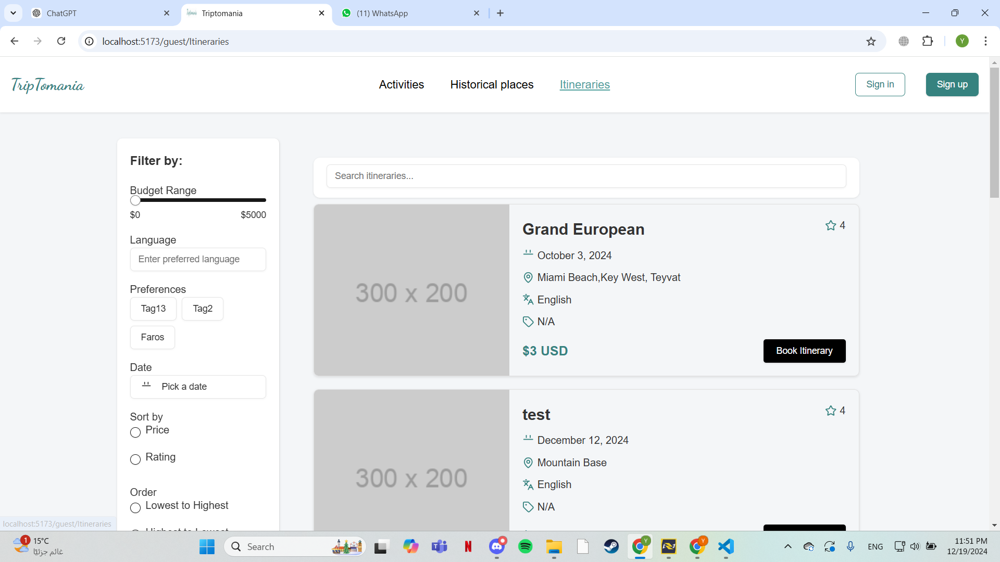

# Triptomania

## Description
This project is a travel platform designed to simplify the process of planning and booking vacations. It provides users with tools to organize their trips efficiently while offering features to enhance the travel experience. The platform caters to a variety of travel preferences, including historic sites, beaches, shopping, and budget-friendly options.

This platform is intended to streamline the travel planning process, providing users with a centralized solution for managing their trips from start to finish.

Key Features
- Easy trip planning and itinerary management.
- Integration with local attractions and businesses.
- Budget-friendly options and in-app shopping.
- Real-time notifications and updates.


---

## Motivation
The primary motivation behind this project is to simplify and enhance the travel planning experience by addressing common challenges faced by travelers. Many existing platforms require users to juggle multiple apps or websites for booking, budgeting, and discovering activities. This project aims to create a centralized solution that integrates these functionalities into a single platform.

Key motivating factors include:
- *Convenience*: Streamlining the planning process to save time and reduce complexity.
- *Accessibility*: Ensuring users have all essential tools and information in one place.
- *Personalization*: Catering to individual preferences for a more tailored travel experience.
- *Local Engagement*: Promoting local attractions and businesses to create meaningful connections between travelers and destinations.
- *Innovation*: Offering unique features like integrated budgeting and in-app shopping to differentiate from existing solutions.

Ultimately, this project aspires to make travel more accessible, enjoyable, and memorable for users, regardless of their destination or budget.

---

## Build Status
Build status details to be added.

---
## Code Style

The project follows a modern and clean React.js code style, emphasizing maintainability, readability, and scalability. Below are the key conventions:

### General Practices
- **Functional Components**: All components are implemented using functional components and React hooks (`useState`, `useNavigate`) for modern state management and routing.
- **JSX Syntax**: Components use JSX for a declarative UI structure, ensuring clarity in rendering logic.
- **Error Handling**: Client-side and server-side errors are managed with `try-catch` blocks, and meaningful error messages are displayed to users.

### State Management
- **Centralized State Updates**: A single state object is used to manage related form data, minimizing redundant code.
- **Dynamic State Handling**: Form inputs are dynamically updated using a universal `handleChange` method, which maps input `name` attributes to corresponding state fields.

### API Integration
- **Axios Instance**: API calls are handled using a reusable `axiosInstance` that simplifies configuration of base URLs, headers, and interceptors.
- **Error Feedback**: Server-side errors are captured and communicated to users with context-sensitive messages.

### Form Handling
- **Dynamic Input Management**: Input values are bound to state dynamically, ensuring simplicity in handling multiple fields.
- **Validation**: Basic validations are performed using HTML attributes like `required`, with additional error messages displayed for more complex validation scenarios.

### Styling
- **CSS Modules**: Each component has its own CSS file (e.g., `AdvertiserSignUp.css`) for scoped, modular styles.
- **Semantic Class Names**: Class names like `error-message` and `success-message` improve readability and convey intent clearly.

### Accessibility
- **Screen Reader Compatibility**: Error messages and success notifications are marked with roles (e.g., `role="alert"`) for better accessibility.
- **Keyboard Navigation**: Form inputs and buttons are designed to be fully accessible via keyboard navigation.


## Screenshots





---
## Frameworks Used
- *Programming Languages*: CSS, JavaScript
- *Frameworks*:
  - *MongoDB*: NoSQL database for flexible data storage.
  - *Express*: Web application framework for building APIs.
  - *React*: Library for building the user interface.
  - *Node.js*: JavaScript runtime for server-side code.
  - *Vite*: Front-end build tool for optimized development.

---
## Features
1. *Customizable Travel Planning*
   - Personalize your travel experience by specifying preferences such as destinations, activities, and itineraries. The platform tailors recommendations to match your interests.
2. *Integrated Booking System*
   - Book flights, accommodations, and transportation directly through reliable third-party providers without leaving the platform.
3. *Budget Management*
   - Receive activity and destination suggestions that align with your remaining budget. All costs, including transportation, are factored in for easy planning.
4. *Activity Discovery*
   - Access a curated selection of local attractions, museums, and historical landmarks with detailed information.
5. *Notifications and Reminders*
   - Stay updated with real-time notifications about bookings, activities, and travel events.
6. *Itinerary Creation*
   - Create detailed custom itineraries or opt for expert-guided tours.
7. *User Profile Management*
   - Tourists, tour guides, advertisers, and sellers can create and manage profiles, including uploading required documents and updating personal information.
8. *In-App Gift Shop*
   - Browse and purchase souvenirs directly through the platform.
9. *Tour Guide and Seller Tools*
   - Manage tours, itineraries, and product listings in the integrated store.
10. *Advanced Search and Filtering*
    - Find activities, tours, or destinations based on your preferences.
---


---


## Installations

# npm
# vite
# CORS
---


## Tests
Testing details to be added.

```json
// POST /api/login
POST "http://localhost:5000/api/auth/login"
Body:
{
    "username": "sprint2",

    "password": "password",

    "type": "tourist"
}

Expected Response:
Status: 200 OK
Body:
{
  "message": "Login successful"
}
```


## How to Use

---
# Setup and Installation

Follow these steps to set up the project on your local machine.

## 1. Clone the Repository
Clone the repository to your local machine by running the following command:
git clone https://github.com/yourusername/projectname.git

## 2. Install Dependencies
Navigate into the project directory and install the required dependencies in the root directory and in the frontend directory using :

```bash
$ npm install
```
## 3. Run the Development Server
Open 2 terminals one in the root directory and the other one in the frontend directory and run this command in both of them :

```bash
$ npm run dev
```

You should now be able to access the application in your browser using this link : "**http://localhost:5173**".

Enjoy coding!
---
# Contributing


We appreciate your interest in contributing to this project! Follow the steps below to submit a pull request and contribute effectively.

## How to Submit a Pull Request

1. *Fork the Repository*  
   Click the "Fork" button at the top-right corner of the repository page on GitHub to create a copy of the repository under your GitHub account.

2. *Clone the Forked Repository*  
   Clone your forked repository to your local machine.

3. *Create a New Branch*  
   Create a new branch in your forked repository to isolate your changes.

4. *Make Your Changes*  
   Implement your changes or features, then stage and commit them.

5. *Push Changes to Your Forked Repository*  
   Push the committed changes to the corresponding branch in your forked repository.

6. *Open a Pull Request*  
   Navigate to the original repository (upstream) on GitHub and submit your changes:  
   - Go to the "Pull Requests" tab and click "New Pull Request."  
   - In the "Compare Changes" section, choose your fork and the branch you created.  
   - Add a clear title and description of your pull request, explaining the changes you made.  
   - Click "Create Pull Request" to submit.

## Review and Approval

Once your pull request is submitted:
- It will be reviewed by the maintainers.
- You may be asked to make additional changes.
- After approval, your changes will be merged into the main branch.

Thank you for contributing to the project!


---
# Credits

Special thanks to the following resources for providing guidance and inspiration:

- [Video Tutorial 1](https://youtu.be/O3BUHwfHf84?si=oLRTM62t_ybKc_DJ)  
- [Video Tutorial 2](https://youtu.be/7Q17ubqLfaM?si=PyJ47vfE8PEwLngG)  
- [Video Tutorial 3](https://youtu.be/mbsmsi7l3r4?si=-qnp93gqJgm7wYYM)  

<br>

# Licenses

For detailed third-party license information, see [dependencies.json](dependencies.json).
