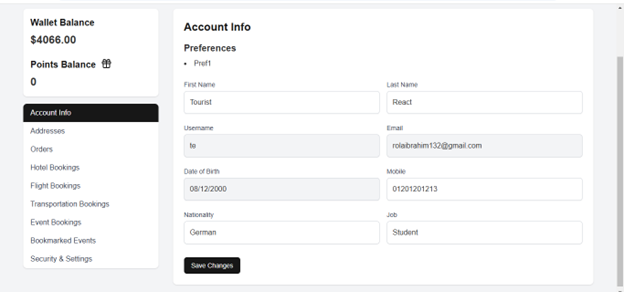

# Triptomania

## Description
This project is a travel platform designed to simplify the process of planning and booking vacations. It provides users with tools to organize their trips efficiently while offering features to enhance the travel experience. The platform caters to a variety of travel preferences, including historic sites, beaches, shopping, and budget-friendly options.

This platform is intended to streamline the travel planning process, providing users with a centralized solution for managing their trips from start to finish.


## Motivation
The primary motivation behind this project is to simplify and enhance the travel planning experience by addressing common challenges faced by travelers. Many existing platforms require users to juggle multiple apps or websites for booking, budgeting, and discovering activities. This project aims to create a centralized solution that integrates these functionalities into a single platform.

Key motivating factors include:
- *Convenience*: Streamlining the planning process to save time and reduce complexity.
- *Accessibility*: Ensuring users have all essential tools and information in one place.
- *Personalization*: Catering to individual preferences for a more tailored travel experience.
- *Local Engagement*: Promoting local attractions and businesses to create meaningful connections between travelers and destinations.
- *Innovation*: Offering unique features like integrated budgeting and in-app shopping to differentiate from existing solutions.

Ultimately, this project aspires to make travel more accessible, enjoyable, and memorable for users, regardless of their destination or budget.
<br>

## Build Status


## Code Style

The project follows a modern and clean React.js code style, emphasizing maintainability, readability, and scalability. Below are the key conventions:

### General Practices
- **Functional Components**: All components are implemented using functional components and React hooks (`useState`, `useNavigate`) for modern state management and routing.
- **JSX Syntax**: Components use JSX for a declarative UI structure, ensuring clarity in rendering logic.
- **Error Handling**: Client-side and server-side errors are managed with `try-catch` blocks, and meaningful error messages are displayed to users.

### State Management
- **Centralized State Updates**: A single state object is used to manage related form data, minimizing redundant code.
- **Dynamic State Handling**: Form inputs are dynamically updated using a universal `handleChange` method, which maps input `name` attributes to corresponding state fields.

### API Integration
- **Axios Instance**: API calls are handled using a reusable `axiosInstance` that simplifies configuration of base URLs, headers, and interceptors.
- **Error Feedback**: Server-side errors are captured and communicated to users with context-sensitive messages.

### Form Handling
- **Dynamic Input Management**: Input values are bound to state dynamically, ensuring simplicity in handling multiple fields.
- **Validation**: Basic validations are performed using HTML attributes like `required`, with additional error messages displayed for more complex validation scenarios.

### Styling
- **CSS Modules**: Each component has its own CSS file (e.g., `AdvertiserSignUp.css`) for scoped, modular styles.
- **Semantic Class Names**: Class names like `error-message` and `success-message` improve readability and convey intent clearly.

### Accessibility
- **Screen Reader Compatibility**: Error messages and success notifications are marked with roles (e.g., `role="alert"`) for better accessibility.
- **Keyboard Navigation**: Form inputs and buttons are designed to be fully accessible via keyboard navigation.


## Screenshots




---
## Frameworks Used
- *Programming Languages*: CSS, JavaScript
- *Frameworks*:
  - *MongoDB*: NoSQL database for flexible data storage.
  - *Express*: Web application framework for building APIs.
  - *React*: Library for building the user interface.
  - *Node.js*: JavaScript runtime for server-side code.
  - *Vite*: Front-end build tool for optimized development.


## Features

1. **Customizable Travel Planning**
   - Personalize your travel experience by specifying preferences such as destinations, activities, and itineraries. The platform tailors recommendations to match your interests.

2. **Integrated Booking System**
   - Book flights, accommodations, and transportation directly through reliable third-party providers without leaving the platform.

3. **Budget Management**
   - Receive activity and destination suggestions that align with your remaining budget. All costs, including transportation, are factored in for easy planning.

4. **Activity Discovery**
   - Access a curated selection of local attractions, museums, and historical landmarks with detailed information.

5. **Notifications and Reminders**
   - Stay updated with real-time notifications about bookings, activities, and travel events.

6. **Itinerary Creation**
   - Create detailed custom itineraries or opt for expert-guided tours.

7. **User Profile Management**
   - Tourists, tour guides, advertisers, and sellers can create and manage profiles, including uploading required documents and updating personal information.

8. **In-App Gift Shop**
   - Browse and purchase souvenirs directly through the platform.

9. **Tour Guide and Seller Tools**
   - Manage tours, itineraries, and product listings in the integrated store.

10. **Advanced Search and Filtering**
    - Find activities, tours, or destinations based on your preferences such as budget, date, category, and ratings.

11. **Account Registration and Login**
    - Sign up as a tourist, tour guide, advertiser, or seller using email, username, and password. Log in securely to access personalized features.

12. **Profile Customization**
    - Tour guides, advertisers, and sellers can create, read, update, and delete their profiles with relevant information such as experience, company details, or product offerings.

13. **Activity and Itinerary Management**
    - Advertisers and tour guides can create, read, update, and delete activities and itineraries, including details like price, location, and tags.

14. **Tourism Governor Management**
    - Add and manage museums, historical places, and location tags for cultural heritage.

15. **Product Management for Sellers**
    - Sellers can add, edit, and manage products including product descriptions, pricing, and quantity. They can also upload product images.

16. **Event Flagging and Reporting**
    - Admins can flag inappropriate events, itineraries, and products. Tourists can file complaints, and admins can manage complaint statuses.

17. **Activity and Itinerary Filtering**
    - Tourists can filter activities, itineraries, and museums by budget, date, preferences, language, or tag.

18. **User Preferences for Travel**
    - Tourists can specify preferences for their trips, such as historic areas, beaches, family-friendly options, shopping, and more.

19. **Booking and Ticketing**
    - Tourists can book tickets for events, activities, and itineraries. They can also cancel bookings within 48 hours of the start date.

20. **Loyalty and Rewards**
    - Tourists receive loyalty points for bookings, which can be redeemed as cash. They can also earn badges based on engagement levels.

21. **Currency and Payment Options**
    - Tourists can select the currency they want to view prices in and choose from multiple payment options, including credit/debit cards, wallets, or cash on delivery.

22. **Sales Reports for Admins and Creators**
    - Admins and creators (tour guides, advertisers, sellers) can view sales reports, including revenue from bookings and products. Reports can be filtered by date, product, or activity.

23. **Complaints and Support**
    - Tourists can file complaints with descriptions of issues. Admins can view and resolve complaints, with the ability to filter and sort by status.

24. **Promo Codes and Discounts**
    - Admins can create and manage promo codes, which tourists can use for discounts on bookings and products.

25. **Wishlist and Cart Management**
    - Tourists can save products to a wishlist, add items to their cart, and manage quantities before checkout.

26. **Order and Delivery Management**
    - Tourists can view their order history, choose delivery addresses, and track the status of their orders. Orders can be canceled with refunds processed into the tourist’s wallet.

27. **Notifications for Events and Orders**
    - Tourists receive notifications about upcoming events, bookings, order updates, and reminders for upcoming trips.

28. **Admin User Management**
    - Admins can manage user accounts, including adding new admins and tourism governors, and deleting accounts when necessary.

29. **Document Verification for New Users**
    - Admins can view documents uploaded by new tour guides, advertisers, and sellers for verification before account approval.

30. **Password Management**
    - Users (tourists, tour guides, advertisers, sellers, admins) can change their passwords and recover forgotten passwords using email-based OTP.

31. **Multi-Role System**
    - Different user roles (admin, tourist, tour guide, advertiser, seller, tourism governor) have distinct capabilities and permissions, ensuring a flexible, role-based access control system.

32. **Language and Accessibility Options**
    - Tourists can select their preferred language for itineraries and events, and activities are also filtered by accessibility features.

33. **Event and Product Ratings & Reviews**
    - Tourists can rate and comment on activities, products, itineraries, and tour guides, helping others make informed decisions.

34. **Ticket Cancellation and Refunds**
    - Tourists can cancel tickets for activities and itineraries, with the refund amount processed back into their wallet or payment method.

35. **Admin Dashboard**
    - Admins can view statistics about the total number of users, new user sign-ups, sales reports, and user activity metrics.

36. **Seller Tools for Managing Products**
    - Sellers can monitor sales, manage product inventory, and track performance of their listed products.

37. **Tour Guide and Advertiser Notifications**
    - Tour guides and advertisers are notified via email when their events or itineraries are flagged as inappropriate.

38. **Payment Receipt Generation**
    - Tourists receive payment receipts via email for all successful transactions, including bookings and product purchases.

39. **Activity and Product Sharing**
    - Tourists can share details of activities, museums, products, and itineraries via email or direct links.

40. **Interactive Maps for Location-based Activities**
    - Activities, itineraries, and products are integrated with Google Maps to provide detailed location-based information for tourists.

41. **Activity and Event Recommendations**
    - Tourists receive personalized recommendations based on their interests, preferences, and previous activity history.

## Code Examples

```js
const login = async (req, res) => {
    const { username, password, type } = req.body;

    // Validate request body
    if (!username || !password || !type || !userCollections[type]) {
        return res.status(400).send("Invalid request");
    }

    const UserModel = userCollections[type];

    try {
        // Find user in the database
        const user = await UserModel.findOne({ username });
        if (!user) return res.status(404).send("User not found");

        // Verify password
        const passwordIsValid = await bcrypt.compare(password, user.password);
        if (!passwordIsValid) return res.status(401).send("Invalid password");

        // Generate access token (2-hour expiry)
        const token = jwt.sign(
            { username: user.username, type, _id: user._id },
            process.env.JWT_SECRET,
            { expiresIn: "2h" }
        );

        // Generate refresh token (7-day expiry)
        const refreshToken = jwt.sign(
            { username: user.username, type, _id: user._id },
            process.env.JWT_REFRESH_SECRET,
            { expiresIn: "7d" }
        );

        // Set tokens as cookies
        res.cookie('token', token, {
            httpOnly: true,
            secure: false,
            maxAge: 2 * 60 * 60 * 1000, // 2 hours
            sameSite: 'lax', // For cross-origin cookies
        });
        

        res.cookie('refreshToken', refreshToken, {
            httpOnly: true,
            secure: process.env.NODE_ENV === 'production',
            maxAge: 7 * 24 * 60 * 60 * 1000, // 7 days
            sameSite: 'lax', // For cross-origin cookies
        });

        res.status(200).json({ message: "Login successful", user: user });
    } catch (err) {
        res.status(500).send("Server error");
    }
};
```
```js
const logout = async (req, res) => {
    const refreshToken = req.cookies.refreshToken;

    if (!refreshToken) {
        return res.status(400).send("Refresh token is required");
    }

    try {
        // Add the refresh token to the blacklist
        await tokenBlacklistModel.create({ token: refreshToken });

        // Clear cookies
        res.clearCookie('token');
        res.clearCookie('refreshToken');

        // Respond with success
        res.status(200).send({ message: "Logged out successfully" });
    } catch (err) {
        res.status(500).send("Server error");
    }
};
```
```js
const checkoutCart = async (req, res) => {
    const userId = req.user._id;

    const { paymentMethod, address, promoCode } = req.body;

    if (!paymentMethod || address < 0) {
        return res.status(400).json({ error: 'Missing required fields: userId, paymentMethod, address' });
    }

    try {
        // Fetch the user and their cart
        const user = await touristModel.findById(userId);
        if (!user) {
            return res.status(404).json({ error: 'User not found' });
        }

        if (!user.cart || user.cart.length === 0) {
            return res.status(400).json({ error: 'Cart is empty' });
        }

        let discount = 0;

        let promo = null;

        const date = new Date();
        const futureDate = new Date(date);
        futureDate.setDate(date.getDate() + 5);

        if (promoCode) {
            promo = await promoCodeModel.findOne({ code: promoCode });
            if (!promo) {
                return res.status(404).json({ error: 'Promo code not found' });
            }

            if (new Date(promo.expiryDate) < Date.now()) {
                return res.status(400).json({ error: 'Promo code has expired' });
            }

            discount = promo.discount;
        }

        if (address < 0 || address >= user.deliveryAddresses.length) {
            return res.status(400).json({ error: 'Incorrect address index' });
        }

        let message = "";

        let products = [];

        let paymentIntent;

        // Calculate the total amount
        let totalAmount = 0;
        for (const item of user.cart) {
            if (!item.productId || !item.quantity) {
                return res.status(400).json({ error: 'Invalid cart item structure. Each item must have an id and quantity.' });
            }

            const product = await productModel.findById(item.productId);
            if (!product) {
                return res.status(404).json({ error: 'Product not found' });
            }

            products.push(item);

            // Calculate amount for the current product
            const tempAmount = product.Price * item.quantity;
            totalAmount += tempAmount;

            // Deduct quantity and update purchasers
            product.Quantity -= item.quantity;
            if (!product.Purchasers.includes(userId)) {
                product.Purchasers.push(userId);
            }

            product.SalesReport.push({
                price: product.Price,
                quantity: item.quantity,
                date: date
            });

            product.Sales += item.quantity;

            // Save the product
            await product.save();

            // Notify if out of stock
            if (product.Quantity === 0) {
                await notifyOutOfStock(product);
                const notification = await notificationModel.create({
                    title: 'Product out of stock',
                    body: `Product ${product.Name} is out of stock`
                });
                const notificationEntry = { id: notification.id, read: false };

                // Add the notification to the seller
                const seller = product.Seller;
                await sellerModel.findByIdAndUpdate(
                    seller,
                    { $push: { notifications: notificationEntry } }
                );

                // Add the notification to all admins
                const admins = await adminModel.find({});
                const adminUpdates = admins.map(admin =>
                    adminModel.findByIdAndUpdate(
                        admin.id,
                        { $push: { notifications: notificationEntry } }
                    )
                );
                await Promise.all(adminUpdates);
            }
        }

        let discountAmount = totalAmount * discount / 100;

        let oldTotalAmount = totalAmount;

        totalAmount -= discountAmount;

        if (paymentMethod === 'COD') {
            message = 'Cash on delivery. Cart cleared';
        } else if (paymentMethod === 'wallet') {
            if (user.wallet >= totalAmount) {
                user.wallet -= totalAmount;
                await user.save();
                message = 'Payment successful. Cart cleared';
            } else {
                return res.status(400).json({ error: 'Insufficient wallet balance' });
            }
        } else if (paymentMethod === 'card') {
            // Convert totalAmount to cents
            const amountInCents = totalAmount * 100;

            // Create a PaymentIntent with Stripe
            paymentIntent = await stripe.paymentIntents.create({
                amount: amountInCents,
                currency: 'usd',
                payment_method_types: ['card'],
                payment_method: 'pm_card_visa',
                confirm: true, // Automatically confirm the payment
            });

            message = 'Payment successful. Cart cleared';
        }

        const tempOrder = await orderModel.create({
            touristId: userId,
            products,
            totalPrice: oldTotalAmount,
            finalPrice: totalAmount,
            paymentMethod,
            deliveryAddress: user.deliveryAddresses[address],
            promoCode: promo ? promo.id : null,
            discountAmount: discountAmount,
            orderDate: date,
            deliveryDate: futureDate
        });

        // Clear the user's cart on successful payment
        user.cart = [];
        await user.save();

        user.orders.push(tempOrder.id);
        await user.save();


        res.status(200).json({
            success: true,
            message,
            order: tempOrder,
            ...(paymentIntent && { paymentIntent })
        });

        await sendProductInvoice(tempOrder);
    } catch (error) {
        res.status(500).json({ error: error.message });
    }
};
```

## API References

### Admin Endpoints
- **View Products**: [http://localhost:5000/api/Admin/Products/ViewProducts](http://localhost:5000/api/Admin/Products/ViewProducts)
- **Admin Home Page**: [http://localhost:5000/api/Admin/AdminHomePage](http://localhost:5000/api/Admin/AdminHomePage)
- **Documents Viewer**: [http://localhost:5000/api/Admin/Documentsviewer/DocumentsViewer.jsx](http://localhost:5000/api/Admin/Documentsviewer/DocumentsViewer.jsx)
- **Generate PDFs**: [http://localhost:5000/api/Admin/GeneratePdfs/GeneratePdfs.jsx](http://localhost:5000/api/Admin/GeneratePdfs/GeneratePdfs.jsx)
- **Complaints List**: [http://localhost:5000/api/Admin/Complaints/Complaints](http://localhost:5000/api/Admin/Complaints/Complaints)
- **Specific Complaint**: [http://localhost:5000/api/Admin/Complaints/Complaint](http://localhost:5000/api/Admin/Complaints/Complaint)
- **Sales Report Viewer**: [http://localhost:5000/api/Admin/SalesReportViewer/SalesReportViewer](http://localhost:5000/api/Admin/SalesReportViewer/SalesReportViewer)
- **Delete Users**: [http://localhost:5000/api/Admin/DeleteUsers/DeleteUsers](http://localhost:5000/api/Admin/DeleteUsers/DeleteUsers)
- **Activity Categories**: [http://localhost:5000/api/Admin/ActivityCategories/ActivityCategories](http://localhost:5000/api/Admin/ActivityCategories/ActivityCategories)
- **Preference Tags**: [http://localhost:5000/api/Admin/PreferenceTags/PreferenceTags](http://localhost:5000/api/Admin/PreferenceTags/PreferenceTags)
- **Promo Code Management**: [http://localhost:5000/api/Admin/Promocode/Promocode](http://localhost:5000/api/Admin/Promocode/Promocode)
- **Account Creation**: [http://localhost:5000/api/Admin/AccountCreation/AccountCreation](http://localhost:5000/api/Admin/AccountCreation/AccountCreation)
- **View Activities**: [http://localhost:5000/api/Admin/ViewActivities/ViewActivities](http://localhost:5000/api/Admin/ViewActivities/ViewActivities)
- **View Itineraries**: [http://localhost:5000/api/Admin/ViewItineraries/ViewItineraries](http://localhost:5000/api/Admin/ViewItineraries/ViewItineraries)

### Advertiser Endpoints
- **Home Page**: [http://localhost:5000/api/Advertiser/AdvertiserHomePage](http://localhost:5000/api/Advertiser/AdvertiserHomePage)
- **View My Activities**: [http://localhost:5000/api/Advertiser/Activities/ViewMyActivities](http://localhost:5000/api/Advertiser/Activities/ViewMyActivities)

### Seller Endpoints
- **View Products**: [http://localhost:5000/api/Seller/Product/ViewProducts](http://localhost:5000/api/Seller/Product/ViewProducts)
- **View My Products**: [http://localhost:5000/api/Seller/Product/ViewMyProducts](http://localhost:5000/api/Seller/Product/ViewMyProducts)
- **Home Page**: [http://localhost:5000/api/Seller/SellerHomePage.jsx](http://localhost:5000/api/Seller/SellerHomePage.jsx)
- **Add Product**: [http://localhost:5000/api/Seller/Product/AddProduct](http://localhost:5000/api/Seller/Product/AddProduct)
- **Edit Product**: [http://localhost:5000/api/Seller/Product/editMyProducts](http://localhost:5000/api/Seller/Product/editMyProducts)
- **Upload Product Picture**: [http://localhost:5000/api/Seller/Product/UploadProductPicture](http://localhost:5000/api/Seller/Product/UploadProductPicture)

### Tourism Governor Endpoints
- **Home Page**: [http://localhost:5000/api/TourismGovernor/TourismGovernorHomePage](http://localhost:5000/api/TourismGovernor/TourismGovernorHomePage)
- **Add Historical Places**: [http://localhost:5000/api/TourismGovernor/HistoricalPlaces/AddHistoricalPlaces](http://localhost:5000/api/TourismGovernor/HistoricalPlaces/AddHistoricalPlaces)
- **Upload Historical Picture**: [http://localhost:5000/api/TourismGovernor/HistoricalPlaces/UploadHistoricalPicture](http://localhost:5000/api/TourismGovernor/HistoricalPlaces/UploadHistoricalPicture)
- **View Tag**: [http://localhost:5000/api/TourismGovernor/Tags/ViewTag](http://localhost:5000/api/TourismGovernor/Tags/ViewTag)

### Tour Guide Endpoints
- **Home Page**: [http://localhost:5000/api/TourGuide/TourGuideHomePage](http://localhost:5000/api/TourGuide/TourGuideHomePage)
- **Add Itinerary**: [http://localhost:5000/api/TourGuide/Itineraries/AddItineraries](http://localhost:5000/api/TourGuide/Itineraries/AddItineraries)
- **View All Itineraries**: [http://localhost:5000/api/TourGuide/TourGuideAllItirenaries.jsx](http://localhost:5000/api/TourGuide/TourGuideAllItirenaries.jsx)
- **View My Itineraries**: [http://localhost:5000/api/TourGuide/Itineraries/ViewMytineraries](http://localhost:5000/api/TourGuide/Itineraries/ViewMytineraries)
- **Edit Itinerary**: [http://localhost:5000/api/TourGuide/Itineraries/editMyItinerary](http://localhost:5000/api/TourGuide/Itineraries/editMyItinerary)
- **Upload Documents**: [http://localhost:5000/api/TourGuide/SignUp/uploadDocuments](http://localhost:5000/api/TourGuide/SignUp/uploadDocuments)

### Tourist Endpoints
- **Home Screen**: [http://localhost:5000/api/Tourist/TouristHomeScreen](http://localhost:5000/api/Tourist/TouristHomeScreen)
- **Get Hotels**: [http://localhost:5000/api/Tourist/HotelBooking/GetHotels](http://localhost:5000/api/Tourist/HotelBooking/GetHotels)
- **File Complaint**: [http://localhost:5000/api/Tourist/Complaints/FileComplaint](http://localhost:5000/api/Tourist/Complaints/FileComplaint)
- **View Products**: [http://localhost:5000/api/Tourist/Products/ViewProducts](http://localhost:5000/api/Tourist/Products/ViewProducts)
- **Get Hotel Offers**: [http://localhost:5000/api/Tourist/HotelBooking/GetHotelOffers](http://localhost:5000/api/Tourist/HotelBooking/GetHotelOffers)
- **Book Hotel**: [http://localhost:5000/api/Tourist/HotelBooking/BookHotel](http://localhost:5000/api/Tourist/HotelBooking/BookHotel)
- **Search Flights**: [http://localhost:5000/api/Tourist/FlightBooking/searchFlights](http://localhost:5000/api/Tourist/FlightBooking/searchFlights)
- **Flight Information**: [http://localhost:5000/api/Tourist/FlightBooking/FlightInfo](http://localhost:5000/api/Tourist/FlightBooking/FlightInfo)
- **Account Management**: [http://localhost:5000/api/Tourist/Account/pages/AccountManagement](http://localhost:5000/api/Tourist/Account/pages/AccountManagement)
- **Product Details**: [http://localhost:5000/api/Tourist/Products/ProductDetails](http://localhost:5000/api/Tourist/Products/ProductDetails)
- **Tourist Cart**: [http://localhost:5000/api/Tourist/TouristCart/TouristCart](http://localhost:5000/api/Tourist/TouristCart/TouristCart)
- **View My Complaints**: [http://localhost:5000/api/Tourist/Complaints/viewMyComplaints](http://localhost:5000/api/Tourist/Complaints/viewMyComplaints)
- **Flight Booking**: [http://localhost:5000/api/Tourist/FlightBooking/FlightBooking](http://localhost:5000/api/Tourist/FlightBooking/FlightBooking)

### Guest Endpoints
- **View Activities**: [http://localhost:5000/api/Guest/Activities/ViewActivities](http://localhost:5000/api/Guest/Activities/ViewActivities)
- **View Itineraries**: [http://localhost:5000/api/Guest/Itineraries/ViewItineraries](http://localhost:5000/api/Guest/Itineraries/ViewItineraries)
- **View Itinerary Details**: [http://localhost:5000/api/Guest/Details/ViewItineraryDetails](http://localhost:5000/api/Guest/Details/ViewItineraryDetails)
- **Activity Details**: [http://localhost:5000/api/Guest/Details/ActivityDetails](http://localhost:5000/api/Guest/Details/ActivityDetails)
- **Historical Places Details**: [http://localhost:5000/api/Guest/Details/HistoricalPlacesDetails](http://localhost:5000/api/Guest/Details/HistoricalPlacesDetails)
- **View Historical Places**: [http://localhost:5000/api/Guest/HistoicalPlaces/viewHistoricalPlaces](http://localhost:5000/api/Guest/HistoicalPlaces/viewHistoricalPlaces)

## Tests
Testing details to be added.

```json
// POST /api/login
POST "http://localhost:5000/api/auth/login"
Body:
{
    "username": "sprint2",
    "password": "password",
    "type": "tourist"
}

Expected Response:
Status: 200 OK
Body:
{
  "message": "Login successful",
  "user": { ...userDetails }
}
```

```json
// POST /api/refresh-token
POST "http://localhost:5000/api/auth/refresh-token"
Headers:
{
    "Cookie": "refreshToken=<refresh_token>"
}

Expected Response:
Status: 200 OK
Body:
{
  "message": "Token refreshed successfully"
}
```

```json
// POST /api/logout
POST "http://localhost:5000/api/auth/logout"
Headers:
{
    "Cookie": "refreshToken=<refresh_token>"
}

Expected Response:
Status: 200 OK
Body:
{
  "message": "Logged out successfully"
}
```

```json
// POST /api/requestOtp
POST "http://localhost:5000/api/auth/requestOtp"
Body:
{
    "username": "sprint2",
    "type": "tourist"
}

Expected Response:
Status: 200 OK
Body:
{
  "message": "Email sent successfully"
}
```

```json
// POST /api/verifyOTP
POST "http://localhost:5000/api/auth/verifyOTP"
Body:
{
    "otp": "123456",
    "type": "tourist",
    "username": "sprint2"
}

Expected Response:
Status: 200 OK
Body:
{
  "message": "OTP verified successfully"
}
```

```json
// PUT /api/changePassword
PUT "http://localhost:5000/api/auth/changePassword"
Headers:
{
    "Authorization": "Bearer <token>"
}
Body:
{
    "oldPassword": "oldPassword123",
    "newPassword": "newPassword123",
    "confirmPassword": "newPassword123"
}

Expected Response:
Status: 200 OK
Body:
{
  "message": "Password changed successfully"
}
```

```json
// GET /api/updateUser
GET "http://localhost:5000/api/auth/updateUser"
Headers:
{
    "Authorization": "Bearer <token>"
}

Expected Response:
Status: 200 OK
Body:
{
  "message": "User updated successfully"
}
```

```json
// PUT /api/changeForgotPassword
PUT "http://localhost:5000/api/auth/changeForgotPassword"
Body:
{
    "newPassword": "newPassword123",
    "type": "tourist",
    "username": "sprint2"
}

Expected Response:
Status: 200 OK
Body:
{
  "message": "Password changed successfully"
}
```

```json
// GET /itineraries/viewItineraries
GET "http://localhost:5000/api/itineraries/viewItineraries"

Expected Response:
Status: 200 OK
Body:
{
  "status": true,
  "itineraries": [ ...itineraryDetails ]
}
```

```json
// GET /api/guest/itineraries/sortItineraries
GET "http://localhost:5000/api/guest/itineraries/sortItineraries"
Query Parameters:
{
    "order": "high",  // or "low"
    "sortBy": "price" // or "rating"
}

Expected Response:
Status: 200 OK
Body:
[ ...sortedItineraries ]
```

```json
// GET /api/guest/activities/viewActivities
GET "http://localhost:5000/api/guest/activities/viewActivities"

Expected Response:
Status: 200 OK
Body:
[ ...activities ]
```

```json
// GET /api/guest/activities/filterActivities
GET "http://localhost:5000/api/guest/activities/filterActivities"
Query Parameters:
{
    "minPrice": 100,
    "maxPrice": 500,
    "date": "2024-12-20T00:00:00Z",
    "category": "categoryId",
    "ratings": 4
}

Expected Response:
Status: 200 OK
Body:
[ ...filteredActivities ]
}
```

```json
// GET /api/guest/activities/sortActivities
GET "http://localhost:5000/api/guest/activities/sortActivities"
Query Parameters:
{
    "order": "high",  // or "low"
    "sortBy": "price" // or "ratings"
}

Expected Response:
Status: 200 OK
Body:
[ ...sortedActivities ]
}
```

```json
// GET /api/guest/historicalPlaces/getHistoricalPlaces
GET "http://localhost:5000/api/guest/historicalPlaces/getHistoricalPlaces"

Expected Response:
Status: 200 OK
Body:
{
  "status": true,
  "historicalPlaces": [ ...historicalPlaces ]
}
```

```json
// GET /api/guest/historicalPlaces/filterHistoricalPlaces
GET "http://localhost:5000/api/guest/historicalPlaces/filterHistoricalPlaces"
Query Parameters:
{
    "tags": "tag1,tag2"
}

Expected Response:
Status: 200 OK
Body:
{
  "message": "Fetched historical places by tags",
  "historicalPlaces": [ ...filteredHistoricalPlaces ]
}
```

## How to Use
For a detailed guide on the application use please check this link : https://drive.google.com/drive/folders/1JJnAxkHAUYdDfoogDF_gP-qvOAtZ3gR3?usp=drive_link

## Setup and Installation

Follow these steps to set up the project on your local machine.

### 1. Clone the Repository
Clone the repository to your local machine by running the following command:
git clone https://github.com/Advanced-computer-lab-2024/Triptomania.git

### 2. Install Dependencies
Navigate into the project directory and install the required dependencies in the root directory and in the frontend directory using :

```bash
$ npm install
```
### 3. Run the Development Server
Open 2 terminals one in the root directory and the other one in the frontend directory and run this command in both of them :

```bash
$ npm run dev
```

You should now be able to access the application in your browser using this link : "**http://localhost:5173**".


<br>

# Contributing


We appreciate your interest in contributing to this project! Follow the steps below to submit a pull request and contribute effectively.

## How to Submit a Pull Request

1. *Fork the Repository*  
   Click the "Fork" button at the top-right corner of the repository page on GitHub to create a copy of the repository under your GitHub account.

2. *Clone the Forked Repository*  
   Clone your forked repository to your local machine.

3. *Create a New Branch*  
   Create a new branch in your forked repository to isolate your changes.

4. *Make Your Changes*  
   Implement your changes or features, then stage and commit them.

5. *Push Changes to Your Forked Repository*  
   Push the committed changes to the corresponding branch in your forked repository.

6. *Open a Pull Request*  
   Navigate to the original repository (upstream) on GitHub and submit your changes:  
   - Go to the "Pull Requests" tab and click "New Pull Request."  
   - In the "Compare Changes" section, choose your fork and the branch you created.  
   - Add a clear title and description of your pull request, explaining the changes you made.  
   - Click "Create Pull Request" to submit.

## Review and Approval

Once your pull request is submitted:
- It will be reviewed by the maintainers.
- You may be asked to make additional changes.
- After approval, your changes will be merged into the main branch.

Thank you for contributing to the project!


# Credits

Special thanks to the following resources for providing guidance and inspiration:

- [Video Tutorial 1](https://youtu.be/O3BUHwfHf84?si=oLRTM62t_ybKc_DJ)  
- [Video Tutorial 2](https://youtu.be/7Q17ubqLfaM?si=PyJ47vfE8PEwLngG)  
- [Video Tutorial 3](https://youtu.be/mbsmsi7l3r4?si=-qnp93gqJgm7wYYM)  

<br>

# Licenses

For detailed third-party license information, see [dependencies.json](dependencies.json).
